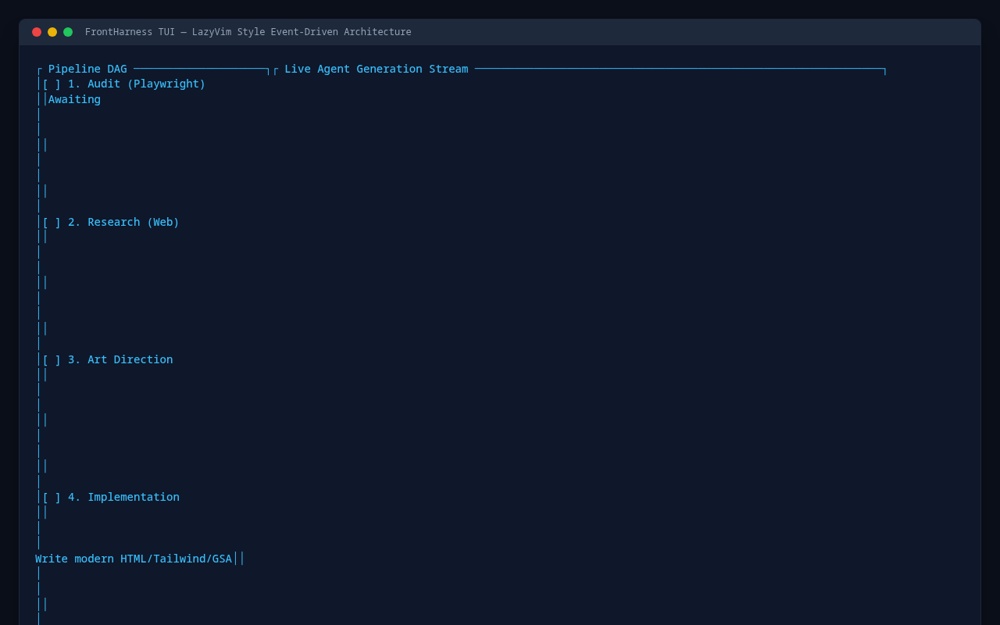
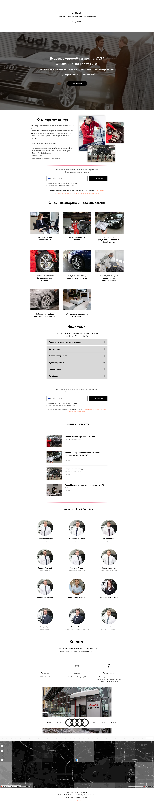
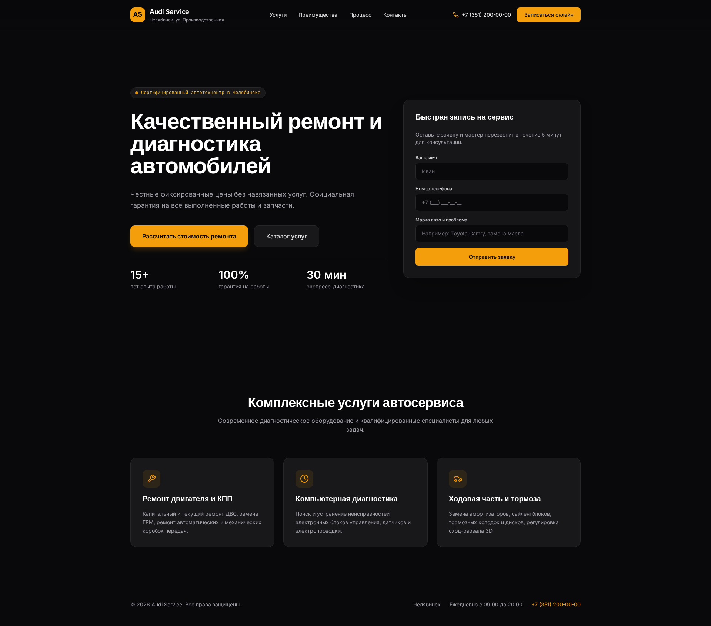

# FrontHarness

FrontHarness is an event-driven CLI/TUI system for automated frontend generation and deep website redesigns. Built in Rust with Ratatui and Tokio, it features a decoupled Pi agent loop, an interactive LazyVim-style terminal user interface with in-TUI pipeline launcher (`r`) and config editor (`c`), a multi-provider LLM engine, a Playwright browser crawler, a local MCP multiplexer, and long-term SQLite memory.

---

## Visual Interface & Redesign Results

### Terminal User Interface (Ratatui / LazyVim Style)


### Redesign Comparison (Desktop & Mobile)

| Original Target Site (Audit) | FrontHarness Redesigned Site (Generated) |
| :---: | :---: |
|  |  |
| *Original Desktop (1920x1080)* | *Redesigned Desktop with GSAP & Bento Layout (1920x1080)* |

---

## How to Run & Input Prompts

You can launch and interact with FrontHarness in two ways:

### Method 1: Inside the Interactive TUI (Recommended)
1. Run `frontharness` (or `fh`).
2. Press **`r`** (or `n`) on the keyboard to open the **New Run / Redesign Launcher** modal.
3. Input the **Target Website URL** (e.g. `https://as-chelyabinsk.ru/`).
4. Press **`Tab`** to switch to the **Prompt / Goal** input field and describe your redesign goals (e.g. `Modern dark industrial design, Bento grid, smooth GSAP animations, optimized conversion`).
5. Press **`Enter`** to launch the multi-agent pipeline and watch real-time DAG steps and token streaming!

### Method 2: Direct CLI Commands
- **Audit & Redesign**:
  ```bash
  frontharness audit --url https://as-chelyabinsk.ru/ --goal "Elevate aesthetics and readability, implement smooth modern animations, optimize conversion."
  ```
- **Headless Mode (No TUI)**:
  ```bash
  frontharness audit --url https://as-chelyabinsk.ru/ --headless
  ```
- **Greenfield Generation**:
  ```bash
  frontharness greenfield --goal "Build a B2B SaaS landing page for an observability platform with Bento Grid."
  ```

---

## TUI Keybindings

| Keybinding | Action |
| --- | --- |
| `r` / `n` | **Launch New Pipeline Run** (Opens interactive URL and Prompt modal) |
| `c` | **Open Config Editor** (Edit API Keys, Models, Reasoning Effort, Search Engine, Ports) |
| `Space` | Toggle options in Config Editor (Search Engine: `duckduckgo`/`tavily`, Reasoning Effort, Headless) |
| `Tab` / `Shift+Tab` | Cycle focus between DAG tree, streaming buffer, and logs |
| `j` / `k` or `Down` / `Up` | Scroll content in active pane |
| `d` | Open Code Diff viewer modal |
| `l` | Open full Event Bus & System Logs modal |
| `a` | Open Extracted Assets & Screenshots modal |
| `m` | Open Long-Term Memory & Feedback modal |
| `?` | Toggle Help popup |
| `Esc` / `q` | Close active modal / Quit application |

---

## License
MIT
